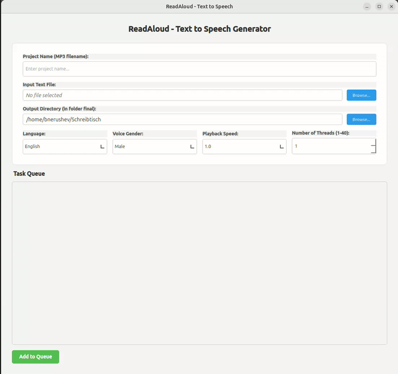

# ReadAloud - High-Performance Text-to-Speech Application

A high-performance Python & PyQt6 desktop application powered by Microsoft Edge TTS to convert text documents into high-quality MP3 audio. It features concurrent queue management with real-time monitoring (progress, ETA) and pause/resume controls, human-like voice synthesis with customizable speed and gender selection, and a multi-threaded architecture (up to 40 threads) with smart text chunking and structured logging.

<p align="center">
  
</p>

## Table of Contents

1. [🛠 System Requirements](#1-system-requirements)
2. [Installation & Setup](#2-installation-setup)
   - [One-line Installation](#21-one-line-installation)
   - [Manual Installation](#22-manual-installation-alternative)
   - [Uninstallation](#23-uninstallation)
3. [Usage](#3-usage)
   - [Starting the Application](#31-starting-the-application)
   - [Running Tests](#32-running-tests)

## 1. 🛠 System Requirements

- **Python**: 3.12 or higher
- **FFmpeg**: Essential for audio stream assembly and speed adjustments.
- **libxcb-cursor**: Required for GUI cursor management.
- **OS**: Linux (was tested on Ubuntu).

---

## 2. Installation & Setup

You can install the application automatically in one command using the remote installation script (it installs dependencies, clones/updates the repository, sets up the virtual environment, and generates a desktop shortcut):

### 2.1. One-line Installation

**Using wget:**
```bash
wget -O install.sh https://raw.githubusercontent.com/Bohdan-Nerushev/ReadAloud/master/scripts/install.sh
bash install.sh
```

*Note: The installation directory will be created at `./ReadAloud` relative to the directory where the command was executed. The desktop shortcut will be generated on your Desktop (e.g., `~/Desktop` or `~/Schreibtisch`). You may need to right-click the shortcut on your desktop and select **"Allow Launching"** to trust and enable it.*

### 2.2. Manual Installation (Alternative)

### 2.2.1. Installing System Dependencies
If you prefer to install manually:
```bash
# Ubuntu/Debian
sudo apt-get update && sudo apt-get install ffmpeg libxcb-cursor0

# Fedora
sudo dnf install ffmpeg libxcb-cursor

# Arch Linux
sudo pacman -S ffmpeg libxcb-cursor
```

1. **Clone the repository**:
   ```bash
   git clone https://github.com/Bohdan-Nerushev/ReadAloud
   cd ReadAloud
   ```

2. **Set up virtual environment**:
   ```bash
   python -m venv venv
   source venv/bin/activate
   ```

3. **Install dependencies**:
   ```bash
   pip install -r requirements.txt
   ```

---

### 2.3. Uninstallation

If you wish to uninstall ReadAloud, you can download and run the remote uninstallation script in one command:

**Using wget:**
```bash
wget -O uninstall.sh https://raw.githubusercontent.com/Bohdan-Nerushev/ReadAloud/master/scripts/uninstall.sh
bash uninstall.sh
```

This will automatically clean up the program files, remove the desktop shortcut, and unregister the application from your system menu.

---

## 3. Usage

### 3.1. Starting the Application
```bash
./scripts/start.sh
```

---

### 3.2. Running Tests
To execute the comprehensive test suite (unit, integration, concurrency, and UI tests):
```bash
./scripts/run_tests.sh
```
