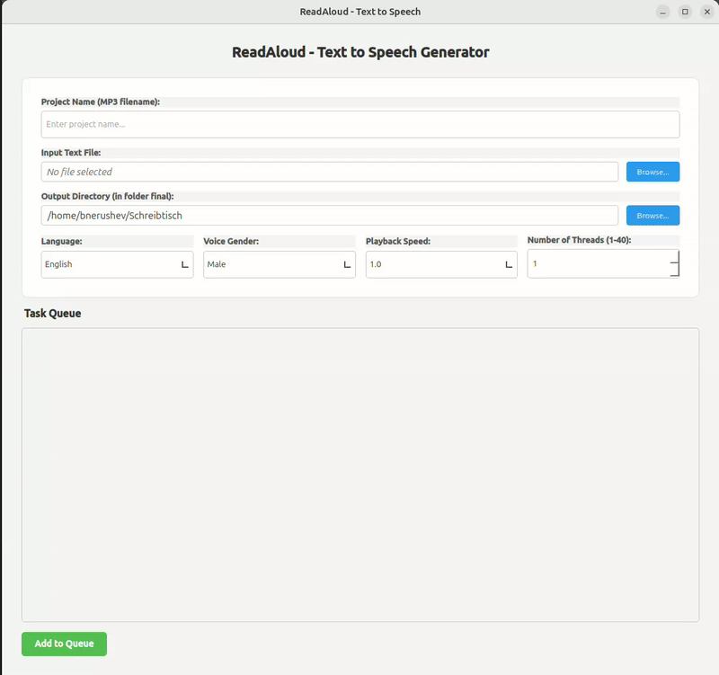

# ReadAloud - High-Performance Text-to-Speech Application

A high-performance Python & PyQt6 desktop application powered by Microsoft Edge TTS, local Piper Docker, and Coqui XTTS-v2 GPU neural synthesis to convert text documents into high-quality MP3 audio. It features concurrent queue management with real-time monitoring (progress, ETA) and pause/resume controls, human-like voice synthesis with customizable speed and gender selection, voice cloning via local GPU acceleration, and a multi-threaded architecture with smart text chunking and structured logging.

<p align="center">
  
</p>

## Table of Contents

- [ReadAloud - High-Performance Text-to-Speech Application](#readaloud---high-performance-text-to-speech-application)
  - [Table of Contents](#table-of-contents)
  - [1. 🛠 System Requirements](#1--system-requirements)
  - [TTS Engine Backends \& Security](#tts-engine-backends--security)
  - [2. Installation \& Setup](#2-installation--setup)
    - [2.1. One-line Installation](#21-one-line-installation)
    - [2.2. Manual Installation (Alternative)](#22-manual-installation-alternative)
    - [2.3. Installing Coqui XTTS-v2 (Local GPU - Optional)](#23-installing-coqui-xtts-v2-local-gpu---optional)
    - [2.4. Uninstallation](#24-uninstallation)
  - [3. Usage](#3-usage)
    - [3.1. Starting the Application](#31-starting-the-application)
    - [3.2. Running Tests](#32-running-tests)

## 1. 🛠 System Requirements

- **Python**: 3.12 or higher
- **FFmpeg**: Essential for audio stream assembly, speed adjustments, and format conversion.
- **NVIDIA GPU & CUDA 12.x** *(Optional)*: Required for local Coqui XTTS-v2 FP16 synthesis with voice cloning (>=4 GB VRAM recommended).
- **Docker** *(Optional)*: Required only if using local neural TTS (Piper).
- **libxcb-cursor**: Required for GUI cursor management.
- **OS**: Linux (tested on Ubuntu / Debian / Arch).

---

## TTS Engine Backends & Security

ReadAloud provides three TTS synthesis engines:

1. **Edge TTS (Cloud - Default)**:
   - Powered by Microsoft Edge Text-to-Speech API.
   - Fast online synthesis supporting multi-threaded requests.

2. **Piper TTS (Local Neural TTS - Optional)**:
   - High-quality neural synthesis running locally via Docker (`rhasspy/wyoming-piper`).
   - **100% Free & Open-Source (MIT License)**: Free for personal and commercial use. No API keys, no subscriptions.
   - **100% Private & Safe**: Performs synthesis entirely offline on your local network interface (`127.0.0.1:10200`).
   - **Resource Management**: Automatically manages Docker container lifecycle to conserve RAM and CPU.

3. **Coqui XTTS-v2 (Local GPU Neural TTS & Voice Cloning - Optional)**:
   - State-of-the-art neural TTS with instant voice cloning from a 5–30 second audio sample (`speaker.wav`).
   - **Hardware Acceleration**: Executes locally on your NVIDIA GPU using PyTorch CUDA FP16.
   - **100% Offline & Private**: Model weights run locally without external cloud calls.
   - **Supported Languages**: English, Ukrainian, German, Russian (`en`, `uk`, `de`, `ru`).

### 🌐 Official Resources & References

- 🎵 **Piper Demos**: [https://rhasspy.github.io/piper-samples/](https://rhasspy.github.io/piper-samples/)
- 📦 **Piper Voice Models**: [https://huggingface.co/rhasspy/piper-voices](https://huggingface.co/rhasspy/piper-voices)
- 🤖 **Coqui XTTS-v2 Model Hub**: [https://huggingface.co/coqui/XTTS-v2](https://huggingface.co/coqui/XTTS-v2)

---

## 2. Installation & Setup

### 2.1. One-line Installation

**Using wget:**
```bash
wget -O install.sh https://raw.githubusercontent.com/Bohdan-Nerushev/ReadAloud/master/scripts/install.sh
bash install.sh
```

### 2.2. Manual Installation (Alternative)

```bash
# Ubuntu/Debian
sudo apt-get update && sudo apt-get install ffmpeg libxcb-cursor0

# Clone repository and set up environment
git clone https://github.com/Bohdan-Nerushev/ReadAloud
cd ReadAloud
python -m venv venv
source venv/bin/activate
pip install -r requirements.txt
```

---

### 2.3. Installing Coqui XTTS-v2 (Local GPU - Optional)

To enable local GPU synthesis and voice cloning with **XTTS-v2**:

1. **Install PyTorch & Coqui TTS dependencies**:
   ```bash
   source venv/bin/activate
   ./scripts/install_xtts.sh
   ```

2. **Generate default speaker reference WAV files**:
   ```bash
   python scripts/generate_example_speakers.py
   ```

3. **Add custom speaker voices (Optional)**:
   Place custom 10–20 second WAV files (24 kHz, Mono) under `src/resource/xtts_speakers/<language>/<gender>.wav` (e.g. `src/resource/xtts_speakers/uk/male.wav`).

---

### 2.4. Uninstallation

```bash
wget -O uninstall.sh https://raw.githubusercontent.com/Bohdan-Nerushev/ReadAloud/master/scripts/uninstall.sh
bash uninstall.sh
```

---

## 3. Usage

### 3.1. Starting the Application
```bash
./scripts/start.sh
```

---

### 3.2. Running Tests
To execute the comprehensive test suite:
```bash
./scripts/run_tests.sh
```
